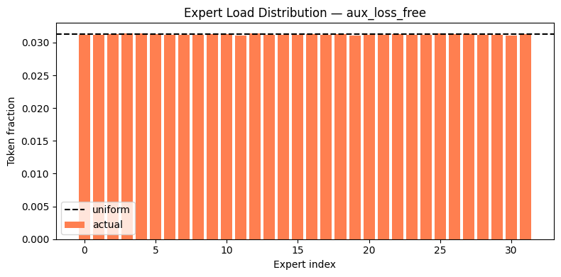
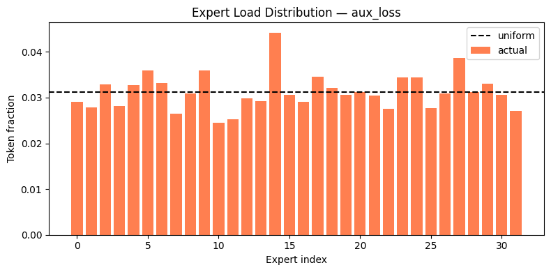
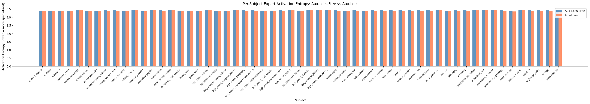
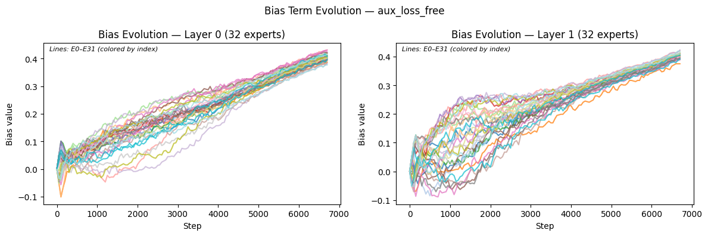

# MoE Routing Circuits: Does Load Balancing Kill Semantic Specialisation?

> **TL;DR:** Auxiliary-Loss-Free (ALF) balancing achieves perfect load distribution but produces routing entropy at 98.5% of the theoretical maximum — meaning the router carries essentially no information about what it's processing. Standard auxiliary-loss balancing fails to fully balance, but at least preserves a weak structural signal. At small scale, perfect balance and meaningful routing are mutually exclusive.

Study done with the help of Sonnet 4.6 (Writing, Organizing)

---

## The Question

Mixture-of-Experts models route tokens to different expert networks depending on the input. In theory, experts should specialise — anatomy tokens go to expert A, code tokens go to expert B. In practice, load balancing mechanisms are needed to prevent a few experts from dominating.

Two dominant strategies exist:
- **Auxiliary-Loss (AL):** adds a differentiable penalty to the training objective to discourage imbalance
- **Auxiliary-Loss-Free (ALF):** maintains per-expert bias terms updated heuristically after each step, without touching the gradient — the approach used in DeepSeek-V3

The question: does the choice of balancing strategy affect whether routing circuits carry semantic information?

---

## Setup

| | |
|---|---|
| Architecture | DeepSeekMoE-style, 298M parameters |
| Layers | 8 transformer layers |
| Experts | 32 routed + 2 shared, top-4 selection |
| Training data | WikiText-2, 10 epochs (~27M effective tokens) |
| Probe | 57 MMLU subjects, 50 samples each |
| Hardware | NVIDIA RTX 4060 8GB (Kaggle T4 for training) |

Two models trained identically — only the balancing mechanism differs.

---

## Key Findings

### 1. Both models reach equivalent language quality
Final step loss: **2.793 (ALF)** vs **2.758 (AL)** — a 0.6% gap, not a meaningful capability difference. The comparison is valid.

### 2. ALF achieves perfect balance — but at a cost



All 32 experts sit within 0.1% of the 3.125% uniform target by epoch 2. The bias mechanism works exactly as designed.



AL never converges. Expert 14 remains ~40% above uniform at epoch 10 despite the penalty. `α=0.01` is insufficient at this scale.

### 3. Perfect balance = near-zero routing informativeness



| Model | Mean routing entropy | % of max (ln 32) | Subjects with lower entropy |
|---|---|---|---|
| Aux-Loss-Free | 3.4145 | **98.5%** | 2 / 57 |
| Aux-Loss | 3.4007 | 98.1% | 55 / 57 |

ALF's routing distribution is nearly identical regardless of whether the input is anatomy, abstract algebra, or world history. Knowing the subject tells you almost nothing about which expert fires. **This is expert homogenisation, not specialisation.**

### 4. The bias mechanism explains why



ALF biases accumulate monotonically to ~+0.4 by step 6750. At 298M parameters trained on 27M tokens, expert affinity centroids haven't diverged enough for the affinity signal to resist the accumulated bias. The bias simply overrides routing.

This is a **scale effect**. ALF was designed and validated at ≥1B parameters on ≥100B tokens (DeepSeek-V3 operates at 671B parameters). At those scales, expert centroids develop strong semantic differentiation and a γ=0.001 bias nudge is a small correction. At 298M params and 27M tokens, it's a sledgehammer.

### 5. Co-activation structure

| | ALF | AL |
|---|---|---|
| Hub structure | ~5 diffuse weak hubs | ~2 strong hubs (experts 4, 14) |
| Dominant pair | (0, 11), (3, 7) — domain-agnostic | (4, 14) — domain-agnostic |
| Interpretation | Bias-forced diffusion | Genuine affinity concentration |

Neither model routes by domain. Neither model has domain-specific circuits. But AL's routing is at least structurally coherent — the same experts fire consistently because they've learned more useful representations, not because a bias tells them to.

---

## The Core Theoretical Point

Load balancing maximises **H(Z)** — the marginal entropy of the routing distribution. This is not the same as expert specialisation.

Specialisation requires high **I(X;Z) = H(Z) − H(Z|X)** — mutual information between the input and the routing decision. A model can achieve perfect H(Z) while having I(X;Z) ≈ 0.

ALF collapses these into one by forcing H(Z) to its maximum, eliminating any conditional structure. The right metric for future work is I(X;Z), measured via probing classifiers trained on expert activation vectors — not marginal entropy.

---

## What This Experiment Does Not Do (Yet)

- **No probing classifier** — I(X;Z) is inferred from entropy, not measured directly. This is the primary next step.
- **Small scale by necessity** — hardware constrained to a single RTX 4060 (8GB). A replication at ≥1B params is planned.
- **WikiText-2 only** — general text corpus; experts can't develop domain specialisation from homogeneous data regardless of balancing strategy.

---

## Paper

The full writeup is in [`paper.pdf`](paper.pdf) — covers methodology, results, discussion, limitations, and citations.

---

## Repo Structure

```
├── README.md
├── MoE Circuit Tracing Study.pdf
├── notebook.ipynb       ← full experiment (Kaggle-compatible)
└── images/              ← all figures referenced above
```

> **Note:** Some cells may display `Could not render content for 'application/vnd.jupyter.widget-view+json'` when viewed on GitHub. This is a known GitHub limitation with interactive Jupyter widgets (e.g. tqdm progress bars). The notebook runs correctly on Kaggle or locally with Jupyter — all outputs and figures are preserved in `images/`.

---

## Endorsement

This preprint is awaiting arXiv submission in **cs.LG**. If you're a researcher with publications in cs.LG and find this work credible, an endorsement would be genuinely appreciated — you can endorse at [arxiv.org/auth/endorse](https://arxiv.org/auth/endorse).

---

## References

- [Auxiliary-Loss-Free Load Balancing (DeepSeek, 2024)](https://arxiv.org/abs/2408.15664)
- [Load Balancing MoE with Similarity Preserving Routers / SimBal (Omi et al., 2025)](https://arxiv.org/abs/2506.14038)
- [Variational Inference, Entropy and Orthogonality in MoE (Su & Liu, 2026)](https://arxiv.org/abs/2601.03577)
- [Demons in the Detail: On Implementing Load Balancing Loss (Qiu et al., ACL 2025)](https://aclanthology.org/2025.acl-long.249/)
- [A Review on MoE Load Balancing — Pitfalls and Lessons (HuggingFace)](https://huggingface.co/blog/NormalUhr/moe-balance)
- [DeepSeek-V3 Technical Report (2024)](https://arxiv.org/pdf/2412.19437)

---

*Independent research. Feedback and questions welcome.*
